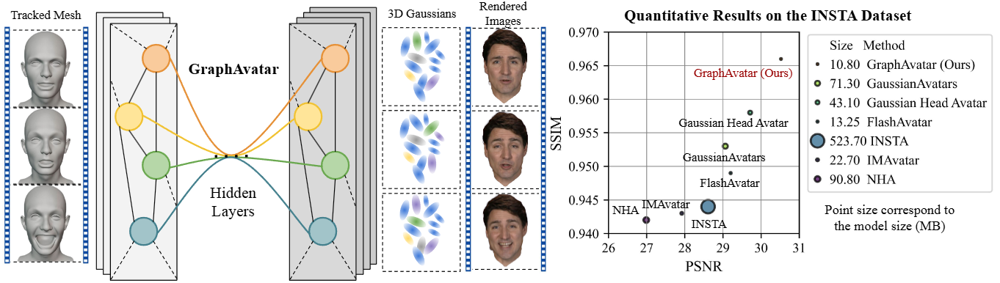
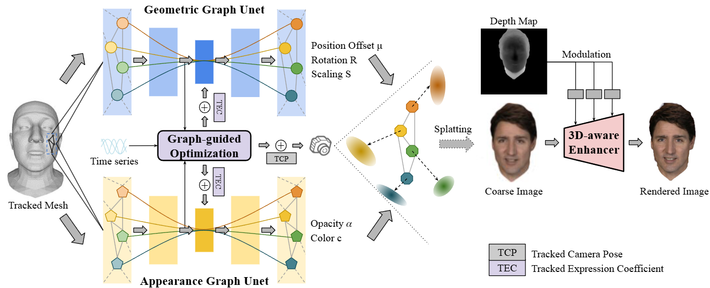

# GraphAvatar: Compact Head Avatars with GNN-Generated 3D Gaussians

> [GraphAvatar: Compact Head Avatars with GNN-Generated 3D Gaussians](./assets/AAAI25_GraphAvatar.pdf)  
> [Xiaobao Wei](https://ucwxb.github.io/), [Peng Chen](https://chenvoid.github.io/), [Ming Lu](https://lu-m13.github.io/), Hui Chen $^\dagger$ , Feng Tian  
> AAAI2025 Main Conference Paper  
> $\dagger$ Corresponding author



We propose a compact method named GraphAvatar that leverages Graph Neural Networks (GNN) to generate the 3D Gaussians for head avatar animation.

## News
- **[2024/12/10]** GraphAvatar is accepted by AAAI2025!

## Overview


Rendering photorealistic head avatars from arbitrary viewpoints is crucial for various applications like virtual reality. Although previous methods based on Neural Radiance Fields (NeRF) can achieve impressive results, they lack fidelity and efficiency. Recent methods using 3D Gaussian Splatting (3DGS) have improved rendering quality and real-time performance but still require significant storage overhead. In this paper, we introduce a method called GraphAvatar that utilizes Graph Neural Networks (GNN) to generate 3D Gaussians for the head avatar. Specifically, GraphAvatar trains a geometric GNN and an appearance GNN to generate the attributes of the 3D Gaussians from the tracked mesh. Therefore, our method can store the GNN models instead of the 3D Gaussians, significantly reducing the storage overhead to just 10MB. To reduce the impact of face-tracking errors, we also present a novel graph-guided optimization module to refine face-tracking parameters during training. Finally, we introduce a 3D-aware enhancer for post-processing to enhance the rendering quality. We conduct comprehensive experiments to demonstrate the advantages of GraphAvatar, surpassing existing methods in visual fidelity and storage consumption. The ablation study sheds light on the trade-offs between rendering quality and model size.

## Citation

If you find this project helpful, please consider citing the our paper:
```
@article{wei2025graphavatar,
  title={GraphAvatar: Compact Head Avatars with GNN-Generated 3D Gaussians},
  author={Wei, Xiaobao and Chen, Peng and Lu, Ming and Chen, Hui and Tian, Feng},
  booktitle={Proceedings of the AAAI Conference on Artificial Intelligence},
  year={2025}
}
```
