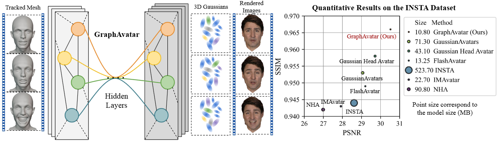
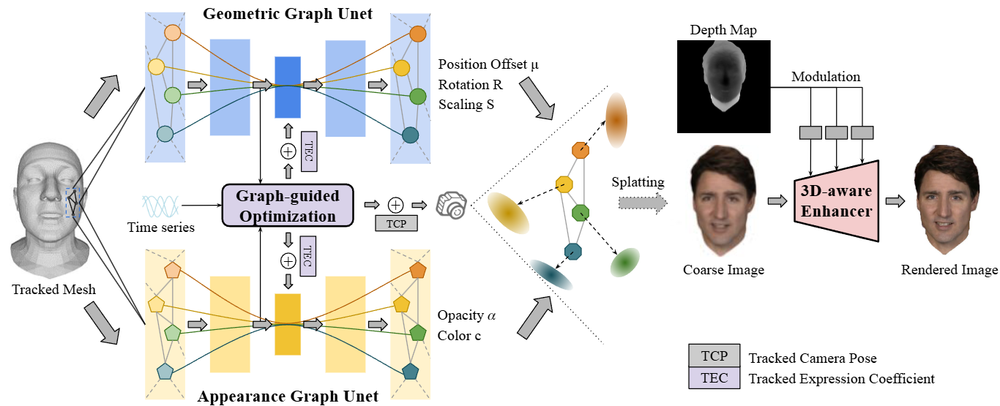

# GraphAvatar: Compact Head Avatars with GNN-Generated 3D Gaussians

> [GraphAvatar: Compact Head Avatars with GNN-Generated 3D Gaussians](https://arxiv.org/abs/2412.13983)  
> [Xiaobao Wei](https://ucwxb.github.io/), [Peng Chen](https://chenvoid.github.io/), [Ming Lu](https://lu-m13.github.io/), Hui Chen $^\dagger$ , Feng Tian  
> AAAI2025 Main Conference Paper  
> $\dagger$ Corresponding author



We propose a compact method named GraphAvatar that leverages Graph Neural Networks (GNN) to generate the 3D Gaussians for head avatar animation.

## News
- **[2024/12/20]** Code & example data release!
- **[2024/12/10]** GraphAvatar is accepted by AAAI2025!

## Overview


Rendering photorealistic head avatars from arbitrary viewpoints is crucial for various applications like virtual reality. Although previous methods based on Neural Radiance Fields (NeRF) can achieve impressive results, they lack fidelity and efficiency. Recent methods using 3D Gaussian Splatting (3DGS) have improved rendering quality and real-time performance but still require significant storage overhead. In this paper, we introduce a method called GraphAvatar that utilizes Graph Neural Networks (GNN) to generate 3D Gaussians for the head avatar. Specifically, GraphAvatar trains a geometric GNN and an appearance GNN to generate the attributes of the 3D Gaussians from the tracked mesh. Therefore, our method can store the GNN models instead of the 3D Gaussians, significantly reducing the storage overhead to just 10MB. To reduce the impact of face-tracking errors, we also present a novel graph-guided optimization module to refine face-tracking parameters during training. Finally, we introduce a 3D-aware enhancer for post-processing to enhance the rendering quality. We conduct comprehensive experiments to demonstrate the advantages of GraphAvatar, surpassing existing methods in visual fidelity and storage consumption. The ablation study sheds light on the trade-offs between rendering quality and model size.

## Getting Started

### Environmental Setups
We recommend using conda for the installation of dependencies. Please enter the following command step by step for preparing the environment.

```bash
sudo apt-get install -y \
    freeglut3-dev \
    python3-opengl \
    libgl1-mesa-dev \
    libglu1-mesa-dev \
    mesa-common-dev \
    libxmu-dev \
    libxi-dev

git clone https://github.com/ucwxb/GraphAvatar
cd GraphAvatar
conda env create -f env.yaml
conda activate GraphAvatar

pip install -r requirements.txt
pip install PyOpenGL PyOpenGL-accelerate
pip install https://data.pyg.org/whl/torch-2.0.0%2Bcu118/torch_cluster-1.6.3%2Bpt20cu118-cp39-cp39-linux_x86_64.whl
pip install https://data.pyg.org/whl/torch-2.0.0%2Bcu118/torch_sparse-0.6.18%2Bpt20cu118-cp39-cp39-linux_x86_64.whl
pip install https://data.pyg.org/whl/torch-2.0.0%2Bcu118/torch_scatter-2.1.2%2Bpt20cu118-cp39-cp39-linux_x86_64.whl
pip install git+https://github.com/NVlabs/tiny-cuda-nn/#subdirectory=bindings/torch

# for submodules
cd submodules/diff-gaussian-rasterization
pip install -e .

cd ../..
cd submodules/simple-knn
pip install -e .

cd ../..
cd submodules/mesh
python setup.py install
```

### Preparing Dataset
We conduct experiments on [INSTA](https://github.com/Zielon/INSTA) and [NBS](https://github.com/USTC3DV/NeRFBlendShape-code). To enable a fair comparison, we use the face tracking tool [metrical-tracker](https://github.com/Zielon/metrical-tracker) to retrack NBS dataset. We also provide a sample scene Justin on INSTA dataset on the [google drive](https://drive.google.com/file/d/1FMtk1ceoKqEymmCo13Sc6VSsMDOA8RRU/view?usp=sharing). Please download and unzip it into the dataset folder. 

```bash
# to download sample scene on google drive
pip install gdown
mkdir dataset
cd dataset
# download and move the zip files into the folder
gdown 1FMtk1ceoKqEymmCo13Sc6VSsMDOA8RRU
unzip insta.zip
```
In addition to the face tracking data, to warmup Graphavatar through pseudo 3DGS attributes, you need to train each scene on the vanilla 3DGS for 30000 iterations and copy "point_cloud.ply" into each scene. 

Finally the file structure is organized as:
```
GraphAvatar
├── dataset
│   ├── insta
│   |   ├── justin
│   |   |   ├── point_cloud.ply (pseudo 3DGS for warmup)
│   |   |   ├── other tracking parameters and folders
│   |   ├── ...
│   ├── nbs
│   |   ├── id1
│   |   ├── ...
└── other codes...
```

### Training

For training on the sample scene, please run:
```bash
# params 1: which GPU. params 2: which scene. 
bash scripts/train_is.sh 0 justin
```
Then you can find checkpoints and training logs into the folder "output".

To continue a training process, You can also modify the param "--start_checkpoint" as the path of your trained checkpoint.


## Citation

If you find this project helpful, please consider citing the our paper:
```
@article{wei2025graphavatar,
  title={GraphAvatar: Compact Head Avatars with GNN-Generated 3D Gaussians},
  author={Wei, Xiaobao and Chen, Peng and Lu, Ming and Chen, Hui and Tian, Feng},
  booktitle={Proceedings of the AAAI Conference on Artificial Intelligence},
  year={2025}
}
```
